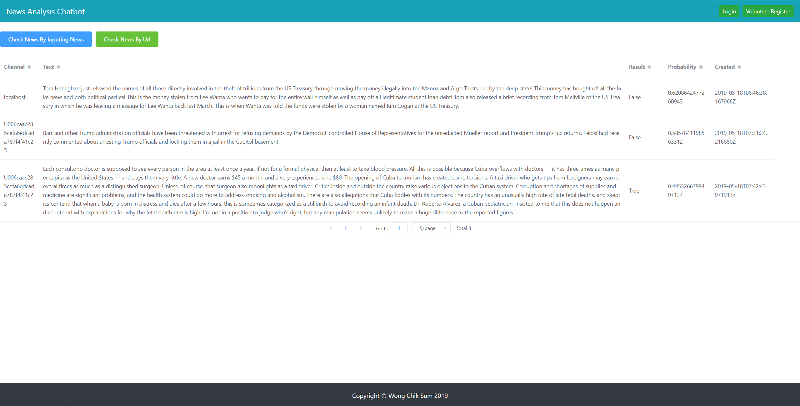

[](https://circleci.com/gh/chiksumwong/news_analysis_chatbot)
# News Analysis Chatbot

## Install package by using requirements.txt
```sh
$ pip install -r requirements.txt
```
## Start Server
```sh
$ python manage.py runserver
```
## Database
### Create migrations file in app by model
```sh
$ python manage.py makemigrations
```
### Create a file to update the database
```sh
$ python manage.py migrate
```
## APIs
More APIs Information: 
- link: https://documenter.getpostman.com/view/3391889/S1M3v521

Or

- Import Chatbot.postman_collection.json to Postman

### Account APIs
| APIs     | Method | Urls                                 |
| -------- | ------ | ------------------------------------ |
| Register | POST   | http://127.0.0.1:8000/user/register/ |
| Login    | POST   | http://127.0.0.1:8000/user/login/    |

### Chatbot APIs (Heroku, LINE Message API)

| APIs     | Method | Urls                                   |
| -------- | ------ | -------------------------------------- |
| Web hook | POST   | http://127.0.0.1:8000/chatbot/webhook/ |

### News Analysis APIs
| APIs                     | Method | Urls                                      |
| ------------------------ | ------ | ----------------------------------------- |
| News Analysis By Text    | POST   | http://127.0.0.1:8000/api/checknews/      |
| News Analysis By URL     | POST   | http://127.0.0.1:8000/api/checknewsbyurl/ |
| Check News Detail By URL | POST   | http://127.0.0.1:8000/api/newsinfo/       |

### News APIs
| APIs           | Method | Urls                                     |
| -------------- | ------ | ---------------------------------------- |
| Create News    | POST   | http://127.0.0.1:8000/api/news/          |
| Get All News   | GET    | http://127.0.0.1:8000/api/news/          |
| Get News By ID | GET    | http://127.0.0.1:8000/api/news/:news_id/ |
| Update News    | PUT    | http://127.0.0.1:8000/api/news/:news_id/ |
| Delete News    | DELETE | http://127.0.0.1:8000/api/news/:news_id/ |

### Chatbot Record APIs
| APIs             | Method | Urls                                         |
| ---------------- | ------ | -------------------------------------------- |
| Create Record    | POST   | http://127.0.0.1:8000/api/record/            |
| Get All Record   | GET    | http://127.0.0.1:8000/api/record/            |
| Get Record By ID | GET    | http://127.0.0.1:8000/api/record/:record_id/ |
| Update Record    | PUT    | http://127.0.0.1:8000/api/record/:record_id/ |
| Delete Record    | DELETE | http://127.0.0.1:8000/api/record/:record_id/ |

## Model training
```sh
$ python model_training/TrainModel.py
```
## Model testing
```sh
$ python model_training/TestModel.py
```

## Heroku View Log
```sh
$ heroku login

$ heroku logs -t -a news-analysis-chatbot

```
## Heroku database migrate
```sh
$ heroku run python manage.py migrate -a news-analysis-chatbot
```

## Release python environment
```sh
$ pip freeze > requirements.txt
```

## True news websites:
- https://www.nytimes.com/2019/01/18/opinion/sunday/cuba-healthcare-medicare.html?action=click&module=Opinion&pgtype=Homepage


## Fake news websites:
- https://newspunch.com/ag-barr-mocks-pelosi-madam-speaker-bring-handcuffs/


## Chatbot
<p>
<kbd>

</kbd>
<kbd>

</kbd>
</p>

## Dashboard
https://news-analysis-chatbot-frontend.herokuapp.com/
<p>
<kbd>

</kbd>
</p>
Admin:
admin
12345678

Volunteer:
Sam
12345678