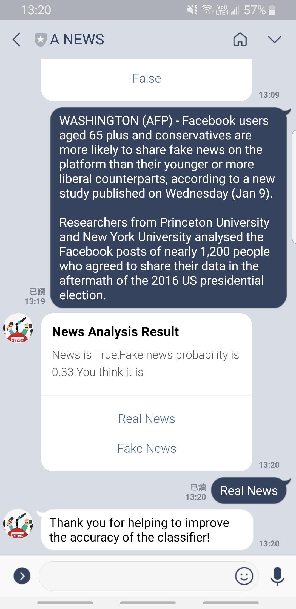

[](https://circleci.com/gh/chiksumwong/news_analysis_chatbot)
# News Analysis Chatbot

## Start Server
```sh
$ python manage.py runserver
```
## Database
### Create migrations file in app by model
```sh
$ python manage.py makemigrations
```
### Update to database
```sh
$ python manage.py migrate
```
## URL
### Chatbot
| Method | Urls                                   |
| ------ | -------------------------------------- |
| POST   | http://127.0.0.1:8000/chatbot/webhook/ |

### News
| Method | Urls                                      |
| ------ | ----------------------------------------- |
| POST   | http://127.0.0.1:8000/api/newsinfo/       |
| POST   | http://127.0.0.1:8000/api/checknews/      |
| POST   | http://127.0.0.1:8000/api/checknewsbyurl/ |


## Model training
```sh
$ python model_training/TrainModel.py
```
## Model testing
```sh
$ python model_training/TestModel.py
```
## Release python environment
```sh
$ pip freeze > requirements.txt
```
## Install package by using requirements.txt
```sh
$ pip install -r requirements.txt
```
## Heroku View Log
```sh
$ heroku login

$ heroku logs -t -a news-analysis-chatbot
```
## True news websites:
- https://www.nytimes.com/2019/01/18/opinion/sunday/cuba-healthcare-medicare.html?action=click&module=Opinion&pgtype=Homepage


## Fake news websites:
- https://newspunch.com/ag-barr-mocks-pelosi-madam-speaker-bring-handcuffs/

## Chatbot
<p>
<kbd>

</kbd>
<kbd>

</kbd>
</p>